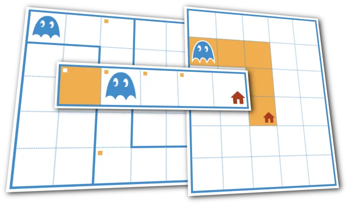

# This repository contains release notes for [StepInDev](https://stepindev.com/) 
StepInDev is a web application that offers a collection of auto-graded programming problems, helping beginners learn basic programming concepts in an engaging way.

Users can control a character, similar to Karel the Robot, using block-based programming akin to Scratch. The platform also supports programming with Python and the Turtle graphics library, both accessible online.

## Release notes
- [Release notes [En]](release-notes/en/release-notes.md)
- [Release notes [Ru]](release-notes/ru/release-notes.md)