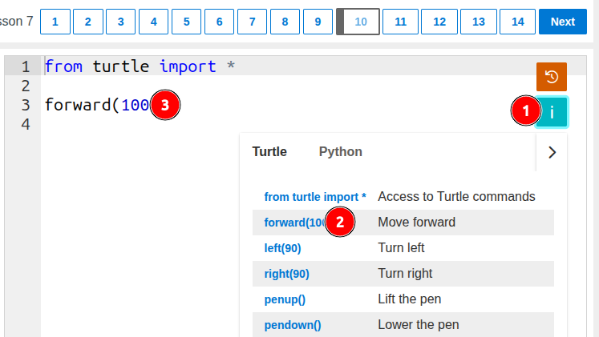
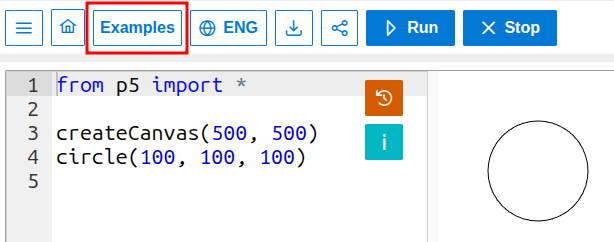
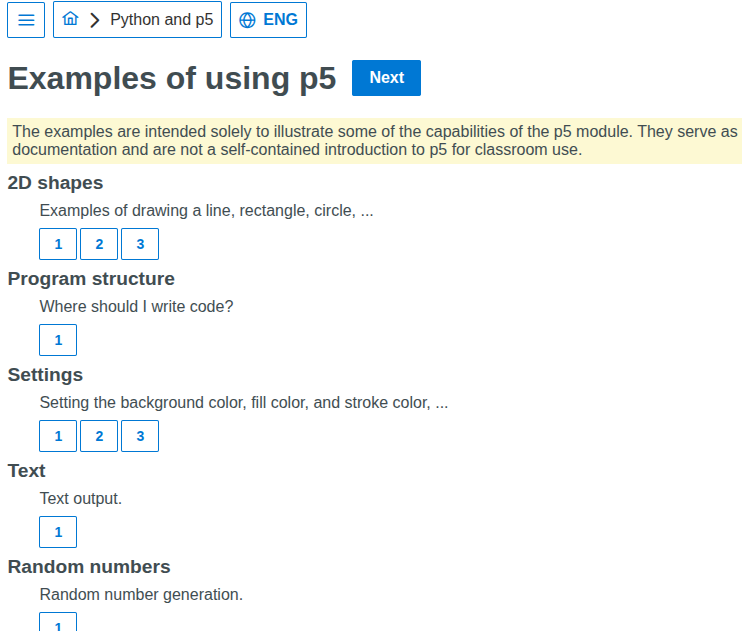
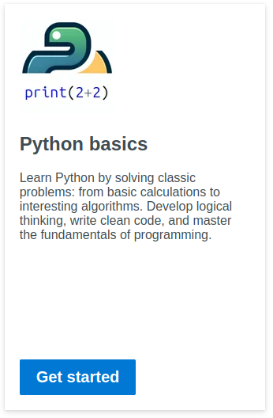

## May 3, 2025
1. Added command reference. Commands can be inserted into the program text by clicking on them in the reference.

   

2. Added the ability to share a program using a link on the "Python Online" page.

   

3. Added graphics support. The command system is based on Processing (p5.js). Usage examples have been added.

   1. Link to the page

      

   2. How it looks

      

   3. Examples

      

## February 23, 2025

The offline version of StepInDev has been updated (it can work without an internet connection). It contains the current state of the website.
You can download it using the following link:  
[step-in-dev-1.1.0-win-x64.zip](https://github.com/step-in-dev/release/releases/download/1.1.0/step-in-dev-1.1.0-win-x64.zip)

Make sure the application is placed in a folder that is not write-protected.

## February 16, 2025

1. A course on the basics of Python has been added, featuring traditional programming fundamentals tasks.  
   Currently, the course includes a small number of beginner-level tasks. More tasks will be added over time.

   

2. A new challenge with three tasks has been added to the Turtle course.

## January 17, 2025
1. The theoretical material for Lesson 7 of the Turtle course has been updated.

## October 12, 2024

1. The `print` and `input` commands for Python now display their output in the panel beneath the text editor.

   

2. The Python page is now accessible without being tied to a specific task.

   

   It can be used for experiments with the turtle module and for solving tasks using input/output commands.

   The Python interpreter being used does not fully implement all modules and language standards. This means, for instance, that not all standard turtle commands are supported, although most work, including command synonyms. All the commands used in the corresponding turtle course and their synonyms will function here.

   Basic elements such as input/output, branching commands, loops, functions, strings, lists, and classes work. Some exotic things, like using `=` in an `f` string `print(f"{myvar=}")` or the walrus operator `:=`, will not work. Features that simply cannot operate in a browser, such as file input/output, will also not work.

   This means the page can certainly be used for solving tasks when learning the basics of the language, but it's not suitable for advanced usage.

   Step execution and viewing variable values during step execution are available. The completed program can be saved to the user's device.

   

## August 18, 2024

StepInDev is now available as a Windows app that can work offline.
You can download it from the following link:
[step-in-dev-1.0.0-win-x64.zip](https://github.com/step-in-dev/release/releases/download/1.0.0/step-in-dev-1.0.0-win-x64.zip)

Make sure that the application is located in a folder that is not write-protected.

## July 31, 2024

1. Added a course on an introduction to Python using the Robot.

    

    Primarily, these are the same tasks that were used for Dave, but now they can be solved using Python.
    The tasks chosen do not involve pollution and variables, with a number of new tasks added.

    ```python
    # Import the Robot module
    from robot import *

    # List of available commands

    # Commands for moving the Robot
    move_right()
    move_left()
    move_up()
    move_down()
    
    # To paint a cell
    paint()

    # To check if a cell is painted
    is_cell_painted()
    is_cell_not_painted()

    # To check for a wall in a selected direction
    is_wall_right()
    is_wall_left()
    is_wall_up()
    is_wall_down()
    
    # To check if there is no wall in a selected direction
    is_free_right()
    is_free_left()
    is_free_up()
    is_free_down()
    ```

    The English grammar in the command names is not perfect, but the names consistently use up, down, left, and right.
    For non-English speaking children, this seems more appropriate.

    The movement commands contain the prefix 'move_' to avoid confusion with Turtle commands, which have 'left' and 'right' commands that behave differently.
## June 16, 2024

1. The precise limit on the number of available commands for the turtle is now displayed in the message for a task not completed.

    
2. Added the ability to view variable values for Python during step-by-step program execution.

    
3. Improved scaling of the turtle window. Now we do not try to fit the entire turtle field on the screen by adding scroll bars to the field. Instead, we allow the page content to extend beyond the screen edges. This is convenient when needing to enlarge the display while presenting on a projector.
4. Added a step-by-step execution button for Dave.
 
    
5. Added tasks involving the use of the "for" loop for the turtle in Python.
