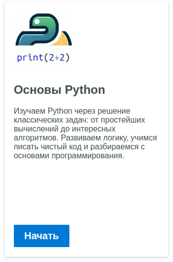

## 25 августа 2025
1. В курсе с Роботом (Урок 13. Конструкция «if») обновлены обстановки в теории и первых заданиях так,
чтобы было трудно использовать `while` вместо `if` в решении.
2. Добавлены два примера с анимацией для модуля p5.
3. Расширен курс «Основы Python» (с классическими задачами на ввод/вывод). Добавлены задания на ветвление и циклы.
4. Улучшены сообщения об ошибках. Теперь вместо сообщения «bad input» делается попытка вывести, что именно не нравится интерпретатору Python.
5. Часть сообщений об ошибках переведена на русский.

## 12 мая 2025
Обновлен оффлайн вариант StepInDev (может работать без интернета). Содержит текущее состояние сайта.
<br>Известная проблема: команда input() не поддерживается на странице с модулем p5.

Ссылку на скачивание теперь можно найти в меню сайта:


Убедитесь, что приложение будет находиться в папке, не защищенной от записи.

## 3 мая 2025
1. Добавлена справка по командам. Команды можно вставлять в текст программы, кликая по ним в справке.

   

2. Добавлена возможность поделиться программой, используя ссылку, на странице "Python онлайн".

   

3. Добавлена возможность работы с графикой. За основу взята система команд Processing (p5.js). Добавлены примеры использования.

   1. Ссылка на страницу

      

   2. Как выглядит
   
      

   3. Примеры
   
      

## 23 февраля 2025

Обновлен оффлайн вариант StepInDev (может работать без интернета). Содержит текущее состояние сайта.
Скачать можно по следующей ссылке:
[step-in-dev-1.1.0-win-x64.zip](https://github.com/step-in-dev/release/releases/download/1.1.0/step-in-dev-1.1.0-win-x64.zip)

Убедитесь, что приложение будет находиться в папке, не защищенной от записи.

## 16 февраля 2025

1. Добавлен курс, посвященный основам Python и содержащий традиционные задачи по основам программирования.
На данный момент в курс включено небольшое количество задач начального уровня. Впоследствии набор задач будет расширен.

    

2. Добавлено испытание с тремя задачами в курс с черепашкой.

## 17 января 2025
1. Обновлен теоретический материал 7-го урока курса с Черепашкой.

## 12 октября 2024

1. Команды `print` и `input` для Python теперь выводят результат своей работы в панель под текстовым редактором.

    
2. Страница с Python теперь доступна без привязки к конкретной задаче.

    

    Ее можно использовать для экспериментов с черепахой и для решения задач с использованием команд ввода/вывода.
    
    Используемый интерпретатор Python не реализует модули и стандарт языка на 100%. Это означает, например,
    что не все команды стандартной черепахи поддерживаются, хотя большинство работает, включая синонимы команд.
    Все те команды, которые использованы в соответствующем курсе с черепахой, и их синонимы будут работать и здесь.

    Базовые вещи, такие как ввод/вывод, команды ветвления, циклы, функции, строки, списки, классы, работают.
    Какие-то экзотические вещи, вроде использования `=` в `f` строке `print(f"{myvar=}")` или использования моржового
    оператора `:=`, работать не будут. Не будут работать и вещи, которые просто не могут работать в браузере, такие как
    файловый ввод/вывод.

    Это значит, что страница вполне может быть использована для решения задач при изучении основ языка,
    но не годится для случаев продвинутого его использования.

    Доступно выполнение по шагам и просмотр значения переменных при выполнении программы по шагам.
    Готовую программу можно сохранить на устройство пользователя.

    

## 18 августа 2024

StepInDev теперь доступен в виде приложения Windows, которое может работать без интернета.
Скачать можно по следующей ссылке:
[step-in-dev-1.0.0-win-x64.zip](https://github.com/step-in-dev/release/releases/download/1.0.0/step-in-dev-1.0.0-win-x64.zip)

Убедитесь, что приложение будет находиться в папке, не защищенной от записи.

## 31 июля 2024

1. Добавлен курс, по введению в Python с использованием исполнителя Робот.

    

    В основном, это те же задачи, которые использовались для Дейва, но теперь их можно решать на Python.
    Сюда попали те задачи, которые не используют загрязнение и переменные, и было добавлено некоторое количество новых задач.
    ```python
    # Подключение модуля с Роботом
    from robot import *

    # Список доступных команд

    # Команды для перемещения Робота
    move_right()
    move_left()
    move_up()
    move_down()
    
    # Закраска клетки
    paint()

    # Проверка закрашенности клетки
    is_cell_painted()
    is_cell_not_painted()

    # Проверка наличия стены в выбранном направлении
    is_wall_right()
    is_wall_left()
    is_wall_up()
    is_wall_down()
    
    # Проверка отсутствия стены в выбранном направлении
    is_free_right()
    is_free_left()
    is_free_up()
    is_free_down()
    ```

    Английская грамматика в именах команд не идеальна, но зато названия последовательны в использовании up, down, left и right.
    Для не англоговорящих детей это, кажется, более подходящим.

    Команды перемещения содержат префикс move_, чтобы их поведение не путалось с командами черепашки, у которой есть команды left и right, ведущие себя по-другому.
## 16 июня 2024

1. Точное ограничение на количество доступных команд для черепашки теперь отображается в сообщении о невыполненном задании.

    
2. Добавлена возможность просматривать значения переменных для Python при выполнении программы по шагам.

    
3. Улучшено масштабирование окна с черепашкой. Теперь мы не пытаемся уместить все поле черепашки на экране, добавляя полосы прокрутки для поля. Вместо этого позволяем содержимому страницы выходить за границы экрана. Удобно при необходимости увеличить изображение при демонстрации на проекторе.
4. Добавлена кнопка для выполнения по шагам для Дейва.

    
5. Добавлены задачи на использование цикла for для черепашки на Python.
